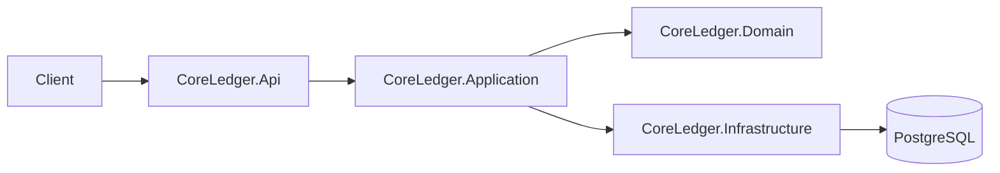

# CoreLedger

CoreLedger is a learning-oriented .NET 9 backend that models a small banking ledger with:
- accounts
- double-entry transfers
- idempotent transfer creation
- balances calculated from ledger entries

The solution is organized as a backend monorepo with `Domain`, `Application`, `Infrastructure`, and `Api` layers.

## Tech Stack

- .NET 9
- ASP.NET Core Minimal APIs
- EF Core + Npgsql
- PostgreSQL 16
- xUnit + FluentAssertions + Testcontainers

## Repository Structure

```text
/services
  /core-ledger
    /src
      /CoreLedger.Api
      /CoreLedger.Application
      /CoreLedger.Domain
      /CoreLedger.Infrastructure
    /tests
      /CoreLedger.Tests
/docker
/docs
CoreLedger.sln
README.md
CHANGELOG.md
```

## Architecture (High Level)



Key ideas:
- Domain is infrastructure-agnostic.
- Application defines use-case contracts and `Result<T>` boundaries.
- Infrastructure implements persistence, queries, and transactional behavior.
- API stays thin and maps application results to HTTP responses.

## How To Run

Start PostgreSQL:

```bash
docker compose -f docker/docker-compose.yml up -d
```

The default development database settings are:

```text
Host=localhost
Port=5432
Database=coreledger
Username=dev
Password=devpass
```

Run the API:

```bash
dotnet run --project services/core-ledger/src/CoreLedger.Api
```

By default, the development profile listens on:

```text
http://localhost:5035
```

In `Development`, the API applies EF Core migrations on startup.

Optional checks:

```bash
dotnet build
dotnet test
```

## Create Accounts

Create the source account:

```bash
curl -X POST http://localhost:5035/accounts \
  -H "Content-Type: application/json" \
  -d '{"currency":"RUB"}'
```

Create the destination account:

```bash
curl -X POST http://localhost:5035/accounts \
  -H "Content-Type: application/json" \
  -d '{"currency":"RUB"}'
```

Expected response:

```json
{
  "accountId": "11111111-1111-1111-1111-111111111111"
}
```

## Create A Transfer

```bash
curl -X POST http://localhost:5035/transfers \
  -H "Content-Type: application/json" \
  -H "Idempotency-Key: transfer-001" \
  -d '{
    "fromAccountId": "11111111-1111-1111-1111-111111111111",
    "toAccountId": "22222222-2222-2222-2222-222222222222",
    "amount": 100.00,
    "currency": "RUB",
    "bookingDate": "2026-04-28",
    "valueDate": "2026-04-28"
  }'
```

Expected response:

```json
{
  "transferId": "33333333-3333-3333-3333-333333333333"
}
```

If `bookingDate` and `valueDate` are omitted, the API uses the current UTC date in the write path.

## Repeat An Idempotent Request

Send the same request body with the same `Idempotency-Key` again:

```bash
curl -X POST http://localhost:5035/transfers \
  -H "Content-Type: application/json" \
  -H "Idempotency-Key: transfer-001" \
  -d '{
    "fromAccountId": "11111111-1111-1111-1111-111111111111",
    "toAccountId": "22222222-2222-2222-2222-222222222222",
    "amount": 100.00,
    "currency": "RUB",
    "bookingDate": "2026-04-28",
    "valueDate": "2026-04-28"
  }'
```

Expected behavior:
- the API does not create a duplicate transfer
- the response returns the same `transferId` as the first successful request

## Get A Transfer

```bash
curl http://localhost:5035/transfers/33333333-3333-3333-3333-333333333333
```

Example response:

```json
{
  "transferId": "33333333-3333-3333-3333-333333333333",
  "currency": "RUB",
  "ledgerEntries": [
    {
      "entryId": "44444444-4444-4444-4444-444444444444",
      "accountId": "11111111-1111-1111-1111-111111111111",
      "amount": 100.00,
      "currency": "RUB",
      "direction": "Credit",
      "bookingDate": "2026-04-28",
      "valueDate": "2026-04-28"
    },
    {
      "entryId": "55555555-5555-5555-5555-555555555555",
      "accountId": "22222222-2222-2222-2222-222222222222",
      "amount": 100.00,
      "currency": "RUB",
      "direction": "Debit",
      "bookingDate": "2026-04-28",
      "valueDate": "2026-04-28"
    }
  ]
}
```

## Get An Account Balance

```bash
curl http://localhost:5035/accounts/11111111-1111-1111-1111-111111111111/balance
```

Example response:

```json
{
  "accountId": "11111111-1111-1111-1111-111111111111",
  "balance": -100.00,
  "currency": "RUB"
}
```

Balance rules:
- `Debit` contributes `+amount`
- `Credit` contributes `-amount`
- balance is the sum of signed ledger entry amounts for the account

## Error Codes

Expected application errors are returned in a consistent shape:

```json
{
  "error": "not_found",
  "message": "Account not found"
}
```

Current error codes:

| HTTP | `error` | Meaning |
|---|---|---|
| `400` | `invalid` | Invalid request or business precondition failure |
| `400` | `domain_invariant` | Domain invariant violation |
| `404` | `not_found` | Account or transfer was not found |
| `409` | `conflict` | Conflict condition |
| `500` | `unexpected_error` | Unhandled server-side failure |

Transfer-specific notes:
- missing `Idempotency-Key` currently returns HTTP `400`
- account currency mismatch returns `400` with `error: "invalid"`
- repeated request with the same idempotency key returns the original transfer id instead of creating a duplicate

## Available Endpoints

- `POST /accounts`
- `POST /accounts/{id}/close`
- `GET /accounts/{id}/balance`
- `POST /transfers`
- `GET /transfers/{id}`
- `GET /health`
- `GET /ready`

## Architecture Notes

- `Domain` contains entities, value objects, and invariants only.
- `Application` defines contracts and `Result<T>`-based use-case boundaries.
- `Infrastructure` contains EF Core persistence and query/service implementations.
- `Api` stays thin and maps `Result<T>` to HTTP responses.
