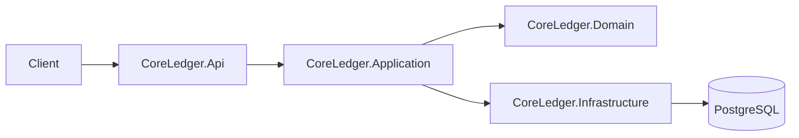

# CoreLedger — Mini Banking Ledger (Monorepo, .NET 9)

> A practical .NET backend project modeling a mini banking core with double-entry accounting, atomic transfers, idempotency, and strong data invariants. Monorepo with a clean layering (Domain/Application/Infrastructure/Api) and integration tests.

[](#)

---

## Overview

CoreLedger is a learning-oriented, production-flavored backend that focuses on:
- **Double-entry ledger** with strict invariants.
- **Atomic money transfers** and **idempotent APIs**.
- **PostgreSQL** with proper transactions, isolation and indexes.
- **Integration tests** against real containers (Postgres) using Testcontainers.
- **Observability mindset** (health endpoints, metrics/logs/traces planned).
---

## Tech Stack

- **.NET 9**, C#, Minimal APIs
- **EF Core** + **Npgsql** (PostgreSQL)
- **xUnit**, **FluentAssertions**, **DotNet.Testcontainers**
- (Optional, later) **OpenAPI/Swagger**, **OpenTelemetry**, Prometheus-compatible metrics

---

## Repository Structure

```
/services
  /core-ledger
    /src
      /CoreLedger.Api            # Endpoints, DI, web configuration
      /CoreLedger.Application    # Use-case contracts, ports
      /CoreLedger.Domain         # Domain entities/VOs/invariants (pure)
      /CoreLedger.Infrastructure # EF Core, DbContext, migrations, repositories
    /tests
      /CoreLedger.Tests          # Unit & integration tests (Testcontainers)
/docker                          # Local infra (Postgres etc.)
/docs                            # Diagrams, notes
/.github/workflows               # CI (to be added)
Directory.Build.props            # Shared SDK settings
CoreLedger.sln
```

---

## Getting Started

> At the initial stage the API/DB are minimal. These commands ensure the solution builds and tests execute.

```bash
dotnet --info
dotnet build
dotnet test
```

When database services are introduced, local infra will live under `/docker` (e.g., `docker compose up -d` for Postgres).

---

## Architecture (High Level)



**Key ideas**
- Domain is **infrastructure-agnostic**.
- Business invariants are enforced in **Domain** and reinforced with **DB constraints**.
- Idempotency is handled at the **API layer** and backed by **unique indexes**.

---

## Design Principles

- **Clear boundaries:** Domain/Application isolated from Infrastructure.
- **Money safety:** `decimal(19,4)`, explicit conversions, no implicit rounding in domain logic.
- **Fail fast:** Validate input and state before DB work.
- **Idempotency:** API-level keys + DB unique constraints (defense in depth).
- **Testability:** Prefer integration tests with real Postgres using Testcontainers.

---

## Standards & Conventions

- C#, `nullable enable`, `LangVersion latest`
- Project layout follows a clean architecture style; EF Core only in Infrastructure